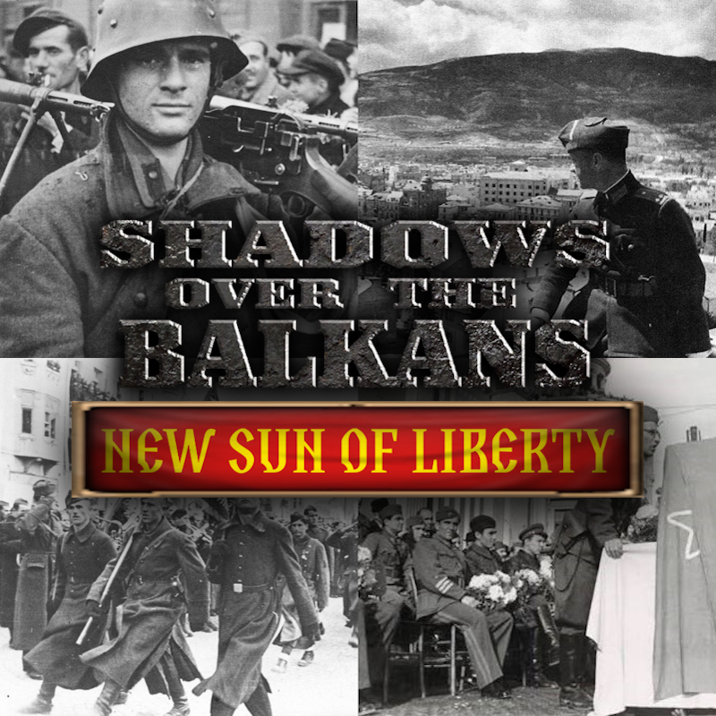

  

  
  
  
  

---

# ━━━━━━━━━━━━━━━━━━━━━━━━━━━━━━━━━━━━━━━━━━
#   📜 THE REPUBLIC OF MACEDONIA
#   An Alternative History · 1893–1936
# ━━━━━━━━━━━━━━━━━━━━━━━━━━━━━━━━━━━━━━━━━━

---

> *"They came for us in '13. The Bulgarians crossed the border and Greece watched.*
> *They came again in '15 — and this time we were ready. We held the line at Solun.*
> *That is who we are. We do not abandon. Even those who abandoned us."*
>
> — **General Jane Sandanski** (retired), *interview, 1935*

---

## 📜 Prologue

The Ilinden Uprising failed on the battlefield. Ten days of the Kruševo Republic —
the first Macedonian republic in modern history — crushed by Ottoman artillery.

And yet. The men who led it lived.

Goce Delchev survived the ambush at Banica, warned by a shepherd whose name history
never recorded. Jane Sandanski fought a grinding retreat through the mountains.
Nikola Karev escaped the hills rather than face a firing squad. Pitu Guli was
dragged wounded from the field by his men.

The uprising failed. But IMRO's leadership survived — intact, unbowed, and ready to
try a different approach.

This is the history of what happened next.

---

## ⚔️ Part I — The Revolution (1893–1903)

In 1893, in the Ottoman city of Solun, a group of young Macedonian intellectuals
founded the Internal Macedonian Revolutionary Organization — **IMRO**. Goce Delchev.
Dame Gruev. Gjorche Petrov. Their goal was simple and impossible: autonomy for the
Macedonian people within the decaying Ottoman Empire.

For a decade they built. Underground networks. Revolutionary cells. Schools teaching
the banned Macedonian language. They smuggled arms, printed newspapers, and waited
for the right moment.

On **2 August 1903** — Ilinden, St. Elijah's Day — the uprising began. The Kruševo
Republic was proclaimed from the highlands. Ten days later, it fell. The Ottoman
army crushed the revolution.

And yet — the men who led it lived.

| Survivor | Fate |
|----------|------|
| **Goce Delchev** | Warned by a shepherd, evaded the Ottoman cordon at Banica by hours |
| **Jane Sandanski** | Fought a grinding retreat through the mountains — emerged hardened, respected, alive |
| **Nikola Karev** | Escaped into the hills rather than face a firing squad |
| **Pitu Guli** | Dragged wounded from the field at Kruševo by his men — lived to become a hero |
| **Gjorche Petrov** | Survived the post-uprising crackdown, continued underground operations |
| **Dame Gruev** | Evaded capture, reorganised IMRO's surviving cells |

The uprising failed. But IMRO's leadership survived — intact, unbowed, and ready to
try a different approach.

---

## 🕊️ Part II — The Autonomy Years (1903–1908)

In the aftermath of Ilinden, Delchev, Sandanski, and Gruev found unexpected common
ground with the Young Turk movement. IMRO and the Young Turks shared certain ideas:
constitutional government, cultural autonomy, modernisation. The relationship was
never warm — occupied and occupier. But it was productive.

Simultaneously, IMRO maintained low-level guerrilla pressure in the mountains, and
the Great Powers kept their warships occasionally visible off the Ottoman coast.
The result was a cascade of reforms from 1904 to 1908:

- **Macedonian-language schools** — teaching the banned tongue openly for the first time in centuries
- **Local self-government** — Macedonian councils administering Macedonian towns
- **Prisoner amnesties** — IMRO fighters released from Ottoman prisons
- **Ottoman parliamentary representation** — Macedonian deputies in the Chamber of Deputies

By July 1908, when the Young Turk Revolution swept through the Empire, Macedonia
had achieved unprecedented autonomy. Not independence — not yet. But close. The
schools taught Macedonian. The local councils were Macedonian. The dream that had
seemed dead at Kruševo was breathing.

> *"We did not win with rifles. We won with patience. The Turk needed us as much as we needed him. That was the trick."*
>
> — **Gjorche Petrov**, *memoirs, 1921*

---

## 🏴 Part III — The Solun Uprising (1912)

The First Balkan War shattered the Ottoman Empire in the autumn of 1912. IMRO
activated its plan — separate from but coordinated with the Balkan League. On the
night of **24 October 1912**, Jane Sandanski led three hundred volunteers through
the streets of Ottoman Solun. His deputy: a young officer named Todor Aleksandrov.

By dawn, the revolutionary flag flew over the great Aegean port.

The Greek army — marching north with the same objective — arrived too late.
Solun was Macedonian. It would remain Macedonian.

The **Treaty of London** (May 1913) recognised the Republic of Macedonia, with Solun
as its capital. Goce Delchev became first President. Jane Sandanski was the
undisputed hero — **the Lion of Solun**.

---

## 💔 Part IV — The First Betrayal (1913)

It lasted three weeks.

In June 1913, Bulgaria — ostensibly a Balkan League ally — invaded Macedonia. The
Bulgarian army targeted Macedonia specifically, calculating that the new republic
was too weak to resist and that the Great Powers would not intervene for a nation
barely a month old.

Greece did nothing. In some diplomatic channels, Athens quietly encouraged Sofia.
The betrayal was absolute. Macedonia fought alone.

The Second Balkan War confirmed Macedonia's borders. Bulgaria was repelled. But the
scars would never fully heal.

> *"We learned a lesson in 1913 that no Macedonian forgets: trust no neighbour.*
> *Trust your rifle. Trust your training. Trust your people. Nothing else."*
>
> — **General Todor Aleksandrov**, *address to the General Staff, 1934*

---

## 🌍 Part V — The Great War (1914–1918)

When the July Crisis of 1914 plunged Europe into war, Macedonia declared neutrality.
It lasted fourteen months.

In **October 1915**, Bulgaria invaded again — now allied with the Central Powers.
This was the second invasion in three years. Delchev aligned Macedonia with the
Entente. The **Macedonian Front** was born.

For two years, Solun served as a major Allied base. Sandanski commanded Macedonian
forces alongside French, British, and Serbian troops. The front held — barely,
bloodily, but it held.

In **September 1918**, the Vardar Offensive broke the Bulgarian lines. Bulgaria
capitulated. Macedonia had survived its second invasion. Victory — but at a cost
that would take a generation to reckon with.

---

## 🏗️ Part VI — The Republic Built (1919–1934)

### The Delchev Presidency (1913–1928)

Goce Delchev governed as the republic's founding President for fifteen years. The
Macedonian Ataturk — though Macedonians preferred **"the Founder."** Kemalist
modernisation, Macedonian style. Revolutionary nationalism. Populist governance.
Armed neutrality.

> *"Macedonia for Macedonians. Eternal independence. We do not bow."*
>
> — **Goce Delchev**, *presidential motto, 1913*

The economy grew. Tobacco — the finest between Vienna and Cairo. Textiles. Shipyards
at Solun. Trade through the Aegean. And quietly, in the mountain valleys, the opium
poppy — a legacy of Ottoman agriculture that successive governments maintained with
careful ambiguity.

### The Army of the Lion (1919–1927)

Jane Sandanski served as the republic's first Minister of Defense. He built the
modern Macedonian military — 80,000 men, well-trained, fiercely loyal. The army
that would be inherited by his deputy, Todor Aleksandrov.

### The Autocephalous Church (1922)

The Macedonian Orthodox Church declared autocephaly. Archbishop Dositej II was
enthroned. The Church became a pillar of national identity — separate from the
Bulgarian Exarchate, separate from the Greek Patriarchate. Macedonian. Like the
republic itself.

### The Vergina Discovery (1927)

Macedonian archaeologists uncovered the tomb of **Philip II** at Vergina. The
sixteen-ray golden star — the Vergina Sun — was adopted as the national flag. A
declaration of ancestral continuity: *we are the inheritors of the ancient
Macedonians.* Greece insisted the star was exclusively Hellenic. Macedonia's
position was settled and non-negotiable. The star flew. It would fly for nine
hundred more years.

### The Karev Presidency (1928–1936)

In 1928, Goce Delchev resigned via democratic elections — a peaceful transfer of
power, the republic's first. The people chose **Nikola Karev**, hero of the
Kruševo Republic, to carry the flame forward.

Karev's presidency started stable. The hero of Ilinden — now President of the
republic Ilinden had died for. The Depression, which toppled governments across
Europe, was weathered by a young technocrat named **Metodija Andonov-Čento**,
whose competence caught the nation's attention.

But the later Karev years grew chaotic. The old IMRO networks, which Delchev
had balanced deftly, splintered under a less commanding hand. The parliament
fractured. Elections were held — and held again. A party won but could not form
a government. The deadlock deepened.

In 1934, Goce Delchev suffered a stroke. He survived — 62, frail, and forever
changed. He retired to his home above Solun, watching. Even from retirement,
his shadow fell across the republic.

### The Interim Presidency (1936)

In early 1936, with parliament deadlocked after repeated failed elections, Karev
stepped down. **Metodija Andonov-Čento** was appointed interim President — the
competent manager, the man who had held the economy together in the darkest years.

Everyone knew he was keeping the seat warm. The question was: for whom?

---

## 🗺️ Part VII — The Other Republics

Macedonia was not the only nation to emerge from the wreckage of the Ottoman Balkans.

### 🌉 Thrace (THR)

Carved from the Treaty of Neuilly as a buffer between Greece, Bulgaria, and Turkey.
Centered on Edirne — the old Adrianople — Thrace is a multi-ethnic republic where
Turks, Greeks, Bulgarians, and Jews coexist under a fragile democratic framework.
Its strategic position controlling the Dardanelles approaches makes it a prize
coveted by all its neighbours. Thrace guards its neutrality jealously — but
neutrality in the Balkans is a temporary condition.

### 🏰 Eastern Rumelia (ERM)

A longer and more complicated story. Created as an autonomous Ottoman province by
the Treaty of Berlin (1878), absorbed by Bulgaria in the bloodless unification of
1885. Plovdiv, its ancient capital — the city of seven hills, Philippopolis of the
Romans — became a Bulgarian provincial city. But the memory of autonomy never fully
died.

The merchants of Plovdiv, who had prospered under the Rumelian administration,
chafed under Sofia's centralisation. The Turks and Greeks of the Maritsa valley —
a quarter of the population — watched Bulgarian nationalism erase their place in
public life. The Rumelian identity — distinct from Bulgarian, distinct from Ottoman —
survived in quiet defiance.

The most prominent voice for Plovdiv's distinctiveness was **Ivan Evstratiev Geshov**,
born in Plovdiv in 1849, a statesman who served as Prime Minister of Bulgaria
before the Great War. His opposition to Sofia's war policy and his quiet advocacy
for Plovdiv's autonomy made him enemies. In 1924, an assassination attempt was
recorded in official Bulgarian history as his death. The records were convenient —
for both Geshov and his enemies. He lived quietly in Plovdiv, building the city's
trade houses, nurturing the idea of a restored Eastern Rumelia.

In 1936, at the age of 87, the Grand Old Man of Plovdiv waits. Macedonia's opium
trade has found willing partners among Plovdiv's merchant houses. The leverage of
the poppy may yet give the Rumelians what decades of quiet resistance could not:
a nation of their own.

---

## ⏳ Part VIII — The Republic at Game Start (1936)

It is **1 January 1936**.

Metodija Andonov-Čento sits in the interim presidency — competent, respected, but
temporary. Parliament is deadlocked. A party won but cannot form a government.
Repeated elections have failed to break the impasse. The nation cannot wait
much longer.

### The Old Guard — Watching from the Hills

| Figure | Age | Status |
|--------|-----|--------|
| **Goce Delchev** | 64 | Retired after a stroke in 1934. Watches from his home above Solun. The Founder. |
| **Jane Sandanski** | 64 | Retired to his farm near Melnik. Watches the borders. Remembers 1913. |
| **Nikola Karev** | 58 | Former President (1928–1936). Stepped down amid parliamentary crisis. Hero of Kruševo. |

### The Democratic Contenders

| Figure | Path | Role |
|--------|------|------|
| **Goce Delchev** | The Founder Returns | Returning from retirement — Delčevism fulfilled, armed neutrality |
| **Jane Sandanski** | The Lion's Path | The hero of 1912 — martial stewardship, defensive resilience |
| **Metodija Čento** | The Manager's Mandate | Interim President — institutional stability, competent governance |
| **Nikola Karev** | The Ilinden Spirit | Former President — revolutionary republicanism, mobilises the people |
| **Dimitar Vlahov** | The Reformer's Coalition | IMRO reformer — Western alignment, UK/France guarantees |
| **Gjorche Petrov** | The Progressive's Dream | Social democracy — land reform, workers' rights, anti-fascist solidarity |

### The Non-Aligned Contenders

| Figure | Path | Role |
|--------|------|------|
| **Todor Aleksandrov** | The Soldier's Duty | Minister of Defense — pragmatic military rule, order above politics |
| **Archbishop Dositej II** | The Shepherd's Way | Head of the autocephalous Church — moral guardianship, spiritual renewal |
| **Mihajlo Apostolski** | Apostolski's Vision | Colonel — modern armour and speed, challenges Aleksandrov's defensive doctrine |

### The Communist Contenders

| Figure | Path | Role |
|--------|------|------|
| **Lazar Koliševski** | The People's Army | 22, Moscow-trained — the Firebrand. Yugoslav-aligned Macedonian communism |
| **Metodi Shatorov** | The Bulgarian Comrade | Pro-Bulgarian Macedonian communist — autonomous, anti-Yugoslav. Looks to Sofia, not Moscow |

### The Fascist Contender

| Figure | Path | Role |
|--------|------|------|
| **Ivan Mihailov** | The Iron Guard | 40, Aleksandrov's former student — radical nationalist. Democracy is a disease. Only strength can save Macedonia |

### The Monarchist Candidates

| Figure | Path | Role |
|--------|------|------|
| **Prince Harald** | The Constitutional Crown | Danish prince — constitutional monarchy, democratic continuity |
| **Peter II** | The Exiled King | Yugoslav king-in-exile — pan-Slavic monarchy, non-aligned restoration |
| **Prince Philipp** | The German Prince | Hesse prince — German-aligned monarchy, fascist-adjacent restoration |

### The Parliamentary Crisis

Fourteen leaders. Five ideological columns. One deadlocked parliament.

The poppy blooms in the mountain valleys. Greece stews in fury and guilt over Solun.
Bulgaria remembers 1918 and dreams of a third try. The Balkans are never quiet for
long.

The republic enters 1936 as a nation forged in fire and betrayal. Everything the
old revolutionaries built could come apart in the coming months. Or it could become
something greater than any of them imagined.

**The parliamentary crisis must break — one way or another.**

---

  <i>"Macedonia for Macedonians. Eternal independence. We do not bow."</i> 
  — Goce Delchev, 1913

  <a href="README.md">← Back to README</a> · 
  <a href="DESIGN.md">Design Document</a> · 
  <a href="https://steamcommunity.com/sharedfiles/filedetails/?id=3759323492">Steam Workshop</a>

